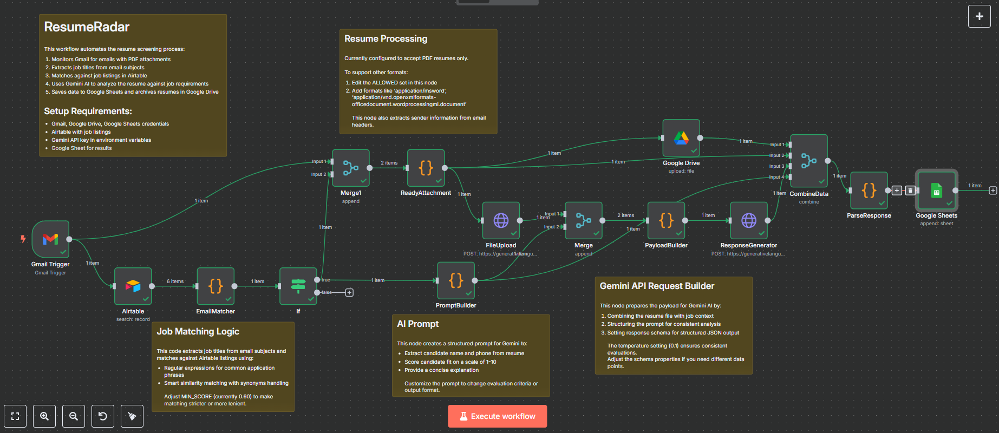

# ResumeRadar



## 🚀 Overview

ResumeRadar is an automated resume screening and analysis tool built with n8n that helps recruiters efficiently process job applications. The system:

1. **Monitors emails** for resume attachments
2. **Analyzes resumes** using Google's Gemini AI
3. **Matches candidates** to job listings stored in Airtable
4. **Scores applications** based on job requirements
5. **Organizes results** in Google Sheets for easy review
6. **Archives resumes** automatically in Google Drive

## 📋 Features

- **Email Integration**: Automatically processes resumes sent via email
- **AI-Powered Analysis**: Uses Gemini AI to extract candidate information and evaluate fit
- **Job Matching**: Intelligently matches incoming applications to open positions
- **Centralized Dashboard**: All candidate data organized in Google Sheets
- **Document Management**: Automatic filing of resumes in Google Drive
- **Scalable Architecture**: Docker-based deployment for easy scaling

## 🔧 Tech Stack

- **n8n**: Workflow automation platform
- **Docker**: Containerization
- **Google Gemini AI**: Resume analysis and information extraction
- **Gmail API**: Email monitoring and parsing
- **Google Drive API**: Document storage
- **Google Sheets API**: Data organization
- **Airtable API**: Job listing management

## ⚙️ Architecture

The workflow consists of several key components:

1. **Gmail Trigger**: Monitors inbox for emails with attachments
2. **Email Matcher**: Analyzes email subject to match with job listings in Airtable
3. **Attachment Processor**: Extracts and validates resume attachments
4. **Resume Storage**: Saves resumes to Google Drive
5. **AI Analysis**: Uses Gemini AI to analyze resume content against job requirements
6. **Data Collection**: Compiles candidate information, scores, and feedback
7. **Results Storage**: Records all information in Google Sheets

## 🛠️ Setup Instructions

### Prerequisites

- Docker and Docker Compose installed
- Google Cloud Platform account with Gmail, Drive, and Sheets APIs enabled
- Airtable account
- Google Gemini API key

### Step 1: Clone and Configure

1. Clone this repository
2. Copy `.env.example` to `.env`
3. Generate a new encryption key: `openssl rand -hex 16`
4. Update your `.env` file with your details:

```
# basic n8n config
GENERIC_TIMEZONE="UTC"  # Set your timezone
N8N_HOST="localhost"    # Use your domain in production
N8N_PROTOCOL="http"     # Use https in production
N8N_PORT="5678"
N8N_ENCRYPTION_KEY="your-generated-key"

# API Keys
GEMINI_API_KEY="your-gemini-api-key"

# Google OAuth client
GMAIL_CLIENT_ID="your-client-id"
GMAIL_CLIENT_SECRET="your-client-secret"
```

### Step 2: Set Up Google Cloud Platform

1. Create a project in Google Cloud Console
2. Enable Gmail, Drive, and Sheets APIs
3. Configure OAuth consent screen
4. Create OAuth client credentials (Web application type)
5. Add authorized redirect URIs: `http://localhost:5678/oauth2callback`
6. Copy Client ID and Client Secret to your `.env` file

### Step 3: Set Up Airtable

1. Create an Airtable base with a "Job Descriptions" table containing:
   - Job Title
   - Job Code
   - Description
   - Skills Required
   - Experience Required
   - Location
2. Generate a Personal Access Token
3. You'll add this credential directly in n8n

### Step 4: Set Up Google Sheets

1. Create a Google Sheet with the following columns:
   - Job Title
   - Candidate Name
   - Email
   - Contact
   - Resume (will contain hyperlinks)
   - AI Score
   - AI Explanation

### Step 5: Run n8n

1. Start the containers:
   ```bash
   docker compose up -d
   ```
2. Access n8n at `http://localhost:5678`
3. Set up your credentials in the n8n UI:
   - Gmail account (OAuth)
   - Google Sheets (OAuth)
   - Google Drive (OAuth)
   - Airtable (API Token)
   - Gemini API Key

### Step 6: Import the Workflow

1. Go to Workflows → Import From File
2. Select the `workflow.json` file
3. Update node configurations to match your credentials and data sources
4. Save and activate the workflow

## 🚀 Deployment Options

For production use, consider:

1. **Self-hosted server** with proper SSL certificates
2. **n8n Cloud** for managed hosting
3. **Docker with Traefik** for reverse proxy and SSL termination
4. **Authentication** for the n8n interface

## 📊 How It Works

1. An email with a resume attachment arrives in the monitored inbox
2. The workflow extracts the job title from the email subject
3. It matches this against open positions in Airtable
4. The resume is uploaded to Google Drive for storage
5. Gemini AI analyzes the resume against the job requirements
6. Results are recorded in Google Sheets with:
   - Candidate information
   - AI-generated score (1-10)
   - Feedback summary
   - Link to stored resume

## 🔮 Future Enhancements

- **Email Response System**: Automated replies to candidates
- **Interview Scheduling**: Calendar integration for qualified candidates
- **Analytics Dashboard**: Visualizing applicant data and trends

## 📝 License

This project is licensed under the MIT License. See the [LICENSE](LICENSE) file for details.

## 🙋‍♂️ Author

[GitHub: @SameedHusayn](https://github.com/SameedHusayn)
